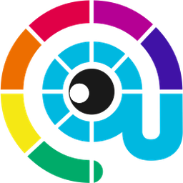

  

<h1 align="center">Art Web Toolkit</h1>

  Art Web Tasarım ekibi için geliştirilen masaüstü uygulaması. 
  Birden fazla aracı tek çatı altında toplar.

  
  
  

---

## Ozellikler

### Site Dashboard
Yonettiginiz web sitelerini grid halinde gorun. Her siteye tiklayinca SEO analizi yapilir, puan hesaplanir, Lighthouse calistirilabilir.

### Google Maps Ripper
Anahtar kelime + sehir/ilce girerek Google Maps'ten isletme verisi cekin. Isletme adi, adres, telefon, website, email, puan, yorumlar, sosyal medya, calisma saatleri, fotograflar. Sonuclari CSV/JSON olarak disari aktarin.

### Lighthouse
Herhangi bir URL'nin performans raporunu alin. Masaustu + Mobil ayri ayri, Chrome DevTools ile birebir ayni HTML rapor.

### SEO Bot
robots.txt, sitemap.xml, llms.txt kontrolu. Meta tag, heading, Open Graph, gorsel alt etiketi analizi. 100 uzerinden puanlama.

---

## Teknolojiler

| Katman | Teknoloji |
|--------|-----------|
| Masaustu | Electron |
| Frontend | React + Tailwind CSS |
| Backend | Python FastAPI |
| Scraping | Playwright (headless Chrome) |
| Veritabani | SQLite |
| Guncelleme | electron-updater (GitHub releases) |

---

## Lisans

Bu yazilim ozel mulkiyete tabidir. Kaynak kodu paylisilamaz, kopyalanamaz veya degistirilemez. Tum haklar saklidir.

**Art Web Tasarim** tarafindan gelistirilmektedir.
